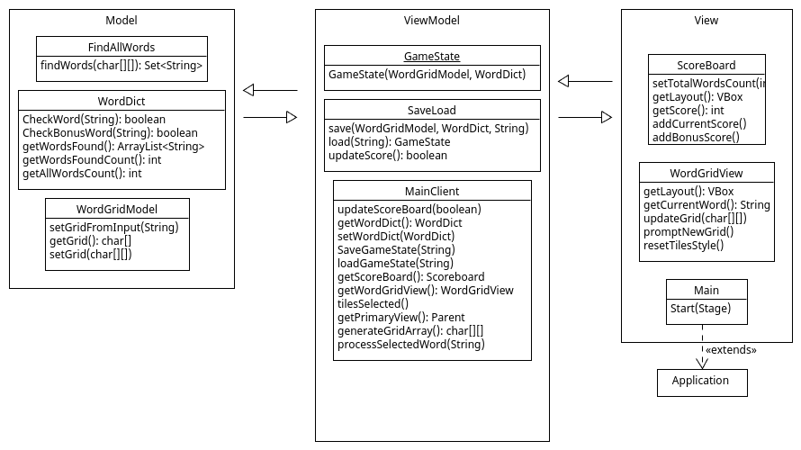

# Csc260 W2024 Project2

Word game implementing Model-View-ViewModel architecture pattern.

## Project Design

## Project Work Split

- Abhay: Dictionary (Model)
- Ashley: Scoreboard (View)
- Darren: WordGrid (View)
- Emma: Main Client, SaveLoad (ViewModel)
- Decide UserLevels later based on how much work left

## Helpful Links
[JavaFX (geeksforgeeks)](https://www.geeksforgeeks.org/javafx-tutorial/)
[JavaFX (oracle)](https://docs.oracle.com/javase/8/javase-clienttechnologies.htm)

## To do

- [ ] total words 
- [ ] highlight selected boxes
- [ ] load levels (add button)
- [ ] bonus words
- [ ] presentation
- [ ] testing write up
